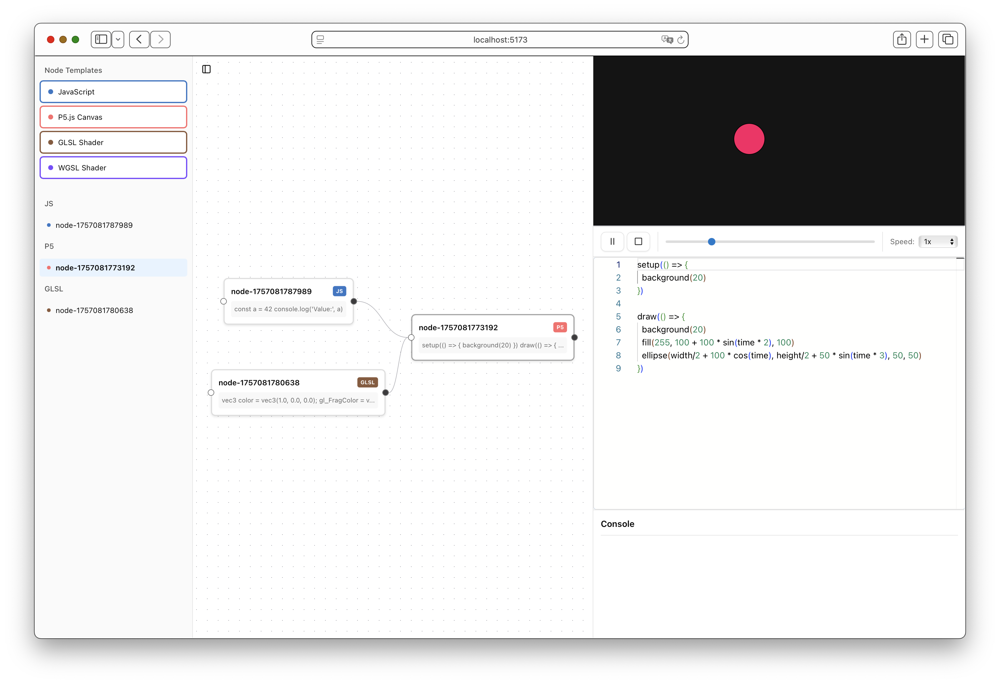

# Tangible

Tangible is a work in progress and still very experimental web IDE for building creative coding applications with full access to the browser environment. It features a code editor, node system, and canvas preview for working with p5.js and shaders. Easily create and deploy interactive or general creative coding projects to the web.
